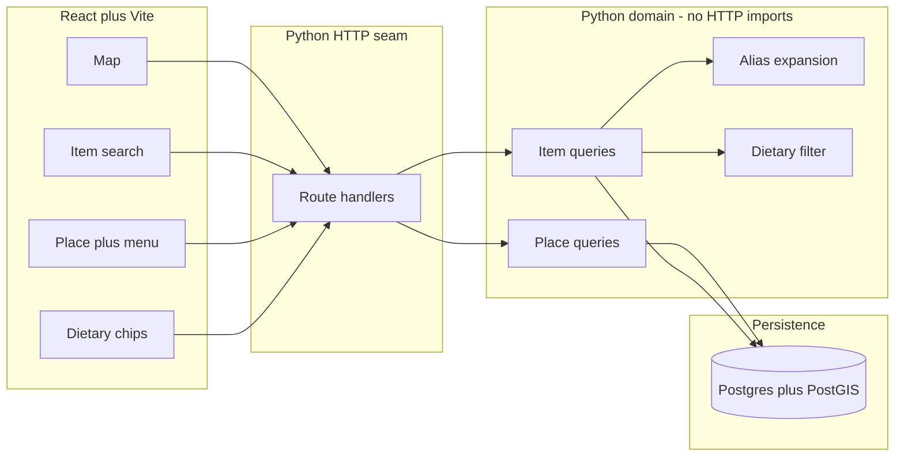

# kurpaest.lt — architecture deep-dive

**Status:** skeleton + work split
**Audience:** kodokaraliai (group implementation)
**Stack constraint:** Python backend (uv, ruff), React + Vite frontend. The HTTP framework is a seam, not a frozen choice.

This document is the source of the GitHub issue split. Each **Work package (WP-n)** below is one independently pickable issue.

---

## 1. Product

**kurpaest.lt** ("kur paėst" — colloquial Lithuanian for "where to eat") is a queryable map of places to eat, with an **itemized menu** for each place.

It is not a review site, a reservation system, or a generic "restaurants near me" clone. The product is the **menu as a queryable dataset**. Places exist so items can be found, compared, and located.

Core jobs:

1. **Map:** "What's around me?" — places on a map, filterable.
2. **Menu:** "What does this place actually sell, and for how much?" — full itemized menu, not a cuisine tag.
3. **Cheapest item:** "I'm feeling a kebab — who sells the cheapest one?" — search across menus, sort by price, pin the place.
4. **Dietary:** "I need vegan / gluten-free / lactose-free" — filter items (and therefore places) by dietary tags.

Lithuania-first: EUR, Lithuanian + English UI, start in Vilnius then other cities.

---

## 2. Why the menu is the centre

A place-centric model (Google Maps, Tripadvisor) answers "is there a kebab shop nearby?". It cannot answer "what is the cheapest kebab within 2 km?" or "which kitchens near me have a gluten-free option under €8?" because they do not store **items with prices and tags**.

kurpaest inverts that:

```
User query  →  matching MenuItems  →  their Places  →  map + list
```

The map is a geospatial view of places that **survive an item query**, not a directory that you later open to squint at a PDF menu.

---

## 3. Domain model

Keep this model in Python types that do **not** import FastAPI (or any HTTP library). Persistence and HTTP adapt it; they do not own it.

### 3.1 Place

A kitchen you can physically go to: restaurant, kiosk, food truck, canteen, bakery with savoury food.

| Field | Notes |
| --- | --- |
| `id` | Stable UUID |
| `name` | Display name |
| `slug` | URL-safe, unique per city |
| `lat`, `lng` | WGS84; required for the map |
| `address`, `city` | Human-readable; city is an enum/string we filter on |
| `hours` | Structured weekly hours (not a free-text blob) so "open now" is possible later |
| `phone`, `website` | Optional |
| `source` | How we know this place (`seed`, `manual`, later `partner`) |
| `updated_at` | Menu freshness lives on the menu, but the place itself also ages |

A place without coordinates is not on the map. Reject it at write time.

### 3.2 Menu

A dated snapshot of what a place sells.

| Field | Notes |
| --- | --- |
| `id` | UUID |
| `place_id` | FK |
| `currency` | `EUR` for v1 |
| `last_verified_at` | When a human (or partner feed) last confirmed prices |
| `language` | `lt` / `en` — a place may have one menu with bilingual names rather than two menus |

Do not version menus as a full history in v1. Overwrite items in place; keep `last_verified_at` honest.

### 3.3 MenuItem

The row everything queries.

| Field | Notes |
| --- | --- |
| `id` | UUID |
| `place_id` | Denormalised for cheap joins (also `menu_id`) |
| `name` | Canonical display name (Lithuanian by default) |
| `name_en` | Optional English |
| `description` | Optional |
| `price_cents` | Integer. Never store money as float. |
| `category` | Coarse: `kebab`, `pizza`, `soup`, `main`, `dessert`, `drink`, `other` — for browsing, **not** for search |
| `dietary_tags` | Set of tags (see below). Empty means "unknown", **not** "contains everything". |
| `search_tokens` | Normalised aliases used by cheapest-item search |

`price_cents` is required. An item without a price cannot participate in cheapest-item ranking — store it only if we later add "price on request", which v1 does not.

### 3.4 DietaryTag

Closed vocabulary, stored as strings on the item:

- `vegetarian`
- `vegan`
- `gluten_free`
- `lactose_free`
- `nut_free`
- `halal`
- `pescatarian`

Unknown / unverified is the default. **Do not infer** "vegetarian" from the dish name. A false positive on allergens or diet is worse than a missing tag. Tags are asserted by whoever entered the menu.

Filtering is conjunctive: the user who asks for `vegan` **and** `gluten_free` gets items that have **both** tags.

### 3.5 Search aliases

Cheapest-kebab fails if we only match the literal string `"kebab"`. Lithuania uses `kebabas`, `döner`, `doner`, `shawarma`, `šaurma`, sometimes `giros`.

A small alias table (query term → item tokens) is a first-class domain object, not a frontend trick:

| term (normalised) | expands to |
| --- | --- |
| `kebab` | `kebab`, `kebabas`, `doner`, `döner`, `shawarma`, `saurma`, `šaurma`, `giros` |
| `cepelinai` | `cepelinai`, `didžkukuliai` |

Normalisation: lowercase, strip Lithuanian diacritics for matching (`š` → `s`, `ė` → `e`), keep the original for display.

---

## 4. Query model

Four queries, one dataset. Implement them as functions over the domain, then hang HTTP on top.

### 4.1 Queryable map of places

```
places_in_bounds(south, west, north, east, city=None) -> list[Place]
```

Returns places whose coordinates fall in the viewport. Optional city filter for the first Lithuanian cities.

The map UI calls this on pan/zoom (debounced). It does **not** download the whole country.

When an item query is active (cheapest kebab, dietary), the map instead renders:

```
places_for_items(matching_items) -> list[Place]
```

Same pins, different predicate. One map component, two sources.

**Tiles:** OpenStreetMap via Leaflet (or MapLibre). No paid map API for v1. Lithuania OSM coverage is good enough.

### 4.2 Itemized menu for a place

```
menu_for_place(place_id) -> list[MenuItem]  # grouped by category in the UI
```

Place detail page: pin, hours, then the full menu with prices. This is how a user verifies the cheapest-kebab hit is real food, not a stale row.

### 4.3 Cheapest-item search

```
cheapest_items(term, *, city=None, near=None, radius_m=None, dietary=(), limit=20)
    -> list[MenuItemWithPlace]
```

Steps:

1. Expand `term` through the alias table after diacritic-folding.
2. Match items whose `search_tokens` or `name` hit any expanded token (substring / token match in v1; full-text later).
3. Apply dietary conjunctive filter if present.
4. Apply geo: if `near` + `radius_m`, keep items whose place is inside the circle; else optional `city`.
5. Sort by `price_cents` ascending, then by distance if geo is present.
6. Return item + place (name, coords, address) so the UI can list **and** pin.

Example: "kebab" in Vilnius, no dietary → cheapest `kebabas` rows first, each with a map pin.

This is **not** "sort places by min kebab price" as a place-level attribute. Computing a denormalised `min_price_by_category` on Place can come later as a cache. The source of truth is the item list.

### 4.4 Dietary-preference filtering

Dietary is a filter that composes with every other query:

- Map + dietary: places that have **at least one** item carrying the requested tags.
- Cheapest-item + dietary: cheapest matching item that also has the tags.
- Place menu: highlight (or hide) items that match the user's standing preference.

Standing preference belongs in frontend local state (and later a user profile). The API is stateless: every request carries `dietary=vegan,gluten_free`.

Empty tag on an item means it **drops out** of a dietary query. We do not treat unknown as matching. The UI must say "showing places with verified vegan dishes", not "all vegan-friendly restaurants".

---

## 5. System shape



**Rules:**

- Query and filter logic lives in the domain package. Route handlers validate HTTP and call domain functions.
- Do not freeze the web framework. FastAPI is what the skeleton uses today because it is ASGI, typed, and easy to test. Swapping it must not require rewriting cheapest-item or dietary code.
- uv is the Python package and version manager. ruff formats and lints. `uv run ruff check` / `uv run ruff format` are the real commands.
- Frontend is a Vite-served SPA. Vite does not run from `file://`. Dev: `npm run dev` inside `frontend/`. Production-like: `npm run build` then preview.

### 5.1 Persistence (when it lands)

PostgreSQL + PostGIS for `geography(Point, 4326)` and `ST_DWithin` / bounding-box queries. SQLite is acceptable **only** for local unit tests of domain logic that do not need real geo.

No ORM requirement. If we use one, keep it out of the domain types (SQLAlchemy models adapt to dataclasses/pydantic models, or we skip the ORM and write SQL).

### 5.2 API sketch (not implemented in this skeleton)

| Method | Path | Purpose |
| --- | --- | --- |
| `GET` | `/` | Skeleton identity (implemented now) |
| `GET` | `/places?bbox=s,w,n,e` | Map pins |
| `GET` | `/places/{id}` | Place detail |
| `GET` | `/places/{id}/menu` | Itemized menu |
| `GET` | `/items?q=kebab&sort=price&dietary=vegan&near=54.68,25.27&radius_m=2000` | Cheapest-item + dietary + geo |

JSON, EUR as cents, coordinates as numbers. Lithuanian names as stored; the client can show `name` or `name_en`.

The current skeleton only implements `GET /`. That is intentional.

### 5.3 Frontend sketch

- One page with a map (Leaflet) taking most of the viewport.
- Search bar: free-text item query ("kebabas") + sort (price default when a query is present).
- Dietary chips: vegan, vegetarian, gluten-free, lactose-free, …
- Click pin → place panel with itemized menu.
- Results list beside the map: cheapest matching items, each row jumps to its pin.

i18n: Lithuanian default, English toggle. Copy lives in the frontend; API payloads stay language-tagged fields.

---

## 6. Data: how menus get in

v1 is **not** a scrape of Lithuania. Nationwide import is a non-goal for the first group push.

Order of operations:

1. **Seed** a handful of Vilnius places with real-enough itemized menus (kebabs, a vegetarian kitchen, a pizza place, a canteen). Enough to demo cheapest-kebab and dietary filters.
2. **Manual contribution** by the group: a documented JSON/YAML (or later admin form) for a place + items. Review in a PR.
3. **Partner / official menu** later, if a kitchen wants in.

Stale prices are the product-trust risk. Show `last_verified_at` on the place panel. Prefer fewer verified menus over thousands of guessed ones.

---

## 7. Alternatives considered

| Option | Why not (for v1) |
| --- | --- |
| Place-only directory (no items) | Cannot answer cheapest-kebab or honest dietary queries. |
| Google Places / Maps Platform as the datastore | No itemized menus, paid, not ours. Fine as a geocoding aid later, not as the menu source. |
| Scraping aggregator sites | Legal/ToS risk, brittle, out of scope. |
| Mongo/Elastic as primary store | Geo + relational items are a Postgres-shaped problem. Add search engine when token match is not enough. |
| Native apps | Website first (`kurpaest.lt`). The API is reusable later. |
| Freeze FastAPI / Django / Flask in the domain | HTTP should stay a seam. |

---

## 8. Risks

| Risk | Severity | Mitigation |
| --- | --- | --- |
| Empty or stale menus make cheapest-kebab a lie | High | Seed few, show verification date, refuse items without `price_cents`. |
| Guessed dietary tags harm users | High | Tags are explicit; unknown ≠ match; never infer from the dish title. |
| Alias gaps (`giros` vs `kebabas`) hide the cheapest hit | Medium | Alias table as its own work package, expandable in PRs. |
| Viewport queries without indexes | Medium | PostGIS gist index on coordinates; bbox required on the map endpoint. |
| Group steps on each other's toes | Medium | Work packages below are split so map UI, menu API, and search can proceed in parallel against the domain types. |

---

## 9. Work packages (GitHub issue split)

These are the implementable units. Open one GitHub issue per WP. Dependencies are advisory — start WP-1 first; WP-3/4/5/6 can mock the domain until persistence lands.

### WP-1 — Domain model

Python types (and tests) for `Place`, `Menu`, `MenuItem`, `DietaryTag`, alias records. No HTTP, no database. This is the contract every other package imports.

### WP-2 — Persistence

Postgres + PostGIS schema and a thin repository that loads/saves the domain types. Local compose file. Migrations. Not visible to users until WP-8 seeds data.

### WP-3 — Queryable map of places

Backend: `places_in_bounds` + `GET /places?bbox=…`.
Frontend: Leaflet (or MapLibre) map of Lithuania/Vilnius, pins from that endpoint, pan/zoom refetch.
Covers the "map of places to eat" job.

### WP-4 — Itemized menus

Backend: `menu_for_place` + `GET /places/{id}` and `GET /places/{id}/menu`.
Frontend: place panel/page listing every item with price and tags.
Covers "itemized menu for each place".

### WP-5 — Cheapest-item query

Backend: `cheapest_items(term, …)` + `GET /items?q=&sort=price`.
Frontend: search box that lists cheapest matching items and highlights their pins.
Covers "I'm feeling a kebab — find the cheapest".

### WP-6 — Dietary-preference filtering

Backend: conjunctive tag filter on item queries and on "places that have at least one matching item".
Frontend: standing dietary chips that compose with map and cheapest-item search.
Covers special dietary preferences. Unknown tags never match.

### WP-7 — Search aliases and Lithuanian normalisation

Alias table, diacritic folding, tests for kebab/kebabas/döner/šaurma and cepelinai/didžkukuliai. WP-5 can ship with literal match; this package makes it actually useful in LT.

### WP-8 — Vilnius seed data

A small, reviewed set of places + itemized menus so WP-3–WP-6 are demoable. Include at least one kebab place, one clearly vegan/vegetarian menu, and one mixed menu with partial tags — so cheapest-item and dietary paths both have something real to show.

### WP-9 — Frontend app shell

Vite app routing, layout (search + chips + map + list), LT/EN copy, empty states. Can land in parallel with backend WPs against mock JSON.

### WP-10 — Place and menu contribution workflow

How a kodokaraliai member adds a kitchen: document the seed format, validation (coords required, price_cents required, tags explicit), and PR checklist. Admin UI is optional and later.

---

## 10. What this repository already contains

- uv-managed Python package (`pyproject.toml`, `uv.lock`) with a FastAPI entry at `GET /` returning service identity.
- ruff for format and lint.
- React + Vite frontend that **must be served** (`npm run dev` or `npm run build` + preview) — not opened as `file://`.
- Tests that hit the real ASGI app.

It deliberately does **not** yet contain the map, menus, cheapest-item query, or dietary filters. Those are WP-3 through WP-6.
